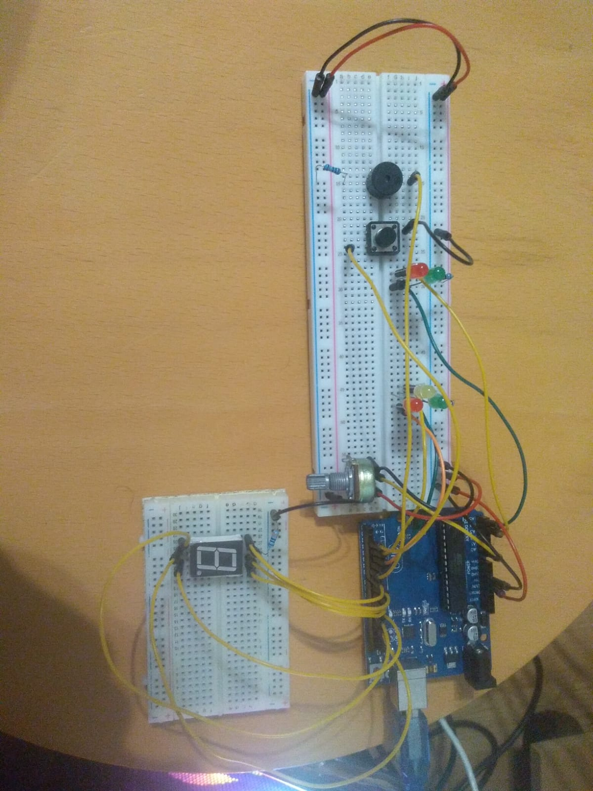

# IntroductionToRobotics (2022 - 2023?)
Hello! I am Andrei and here i will upload, HOPEFULLY, all of my homeworks this semester for my subject: Introduction to Robotics, laboratory.

Friendly reminder: coding style is REALLY important!

Thanks for reading this, i appreciate.

# Homework 1
Task requirements:

Using minimum 1 RGB led and 3 potentiometers, resistors and wires accordingly, control each one of the led's 3 colours with one potentiometer.
Values coming from potentiometers must be mapped to values that will be given as input for the led.

    
  

Video link: https://drive.google.com/file/d/1j_6o8F_s4XQYbD_QbgjprxdQxxQyMSDT/view?usp=sharing

# Homework 1
Task requirements:

Using 5LEDs, 1 button, 1 buzzer, resistors and wires accordingly, create the traffic lights for a crosswalk.

Implementation:

I've used 2 green LEDs and 2 red LEDs one of each for cars, the other for pedestrians and one yellow LED for cars. I've also added a
potentiometer which represents the traffic state at that point: taking values from 0 to 1023 from the potentiometer and mapping them 
to a value in the iterval 1 to 5 seconds. Depending on how busy the traffic is the pedestrians have to wait more/less time. When button is not pressed cars
have green light, pedestrians have red light and the buzzer makes a shot shound every 2 seconds so that blind people can know that there is a crosswalk around
but is red light. When pressing the button I check traffic state and set the waitting time value. After the waitting time is over the buzzer starts ringing
constantly, cars will have yellow light for 1 second and then red, at the same time pedestrians' traffic light will turn green. To make pedestrians' life easier
I have added a 7 segment digit display that shows how many seconds are left for them to pass. When timer goes under 4 seconds the light starts blinking and
the buzzer starts beeping at a constant interval synchronized with the LED's blinking. When timer shows 0, pedestrians' traffig light turns red and 1 seconds after
cars' traffic light turns green again. Aditionally, after pedestrians' traffic light turns red there is a 3 seconds delay untill next cycle regarding the traffic, pressing the button when in cooldown will register you action but it will get triggered only after the button and traffic delay.
Stay safe and be carefull when you cross the stree regardless of the traffic light color!!!

    

Video link: https://drive.google.com/file/d/1m-6RgrHTZjZSGyU8Q3obbON2Pv1ohxRz/view?usp=share_link
