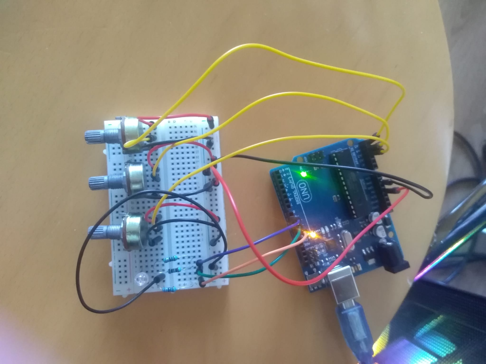
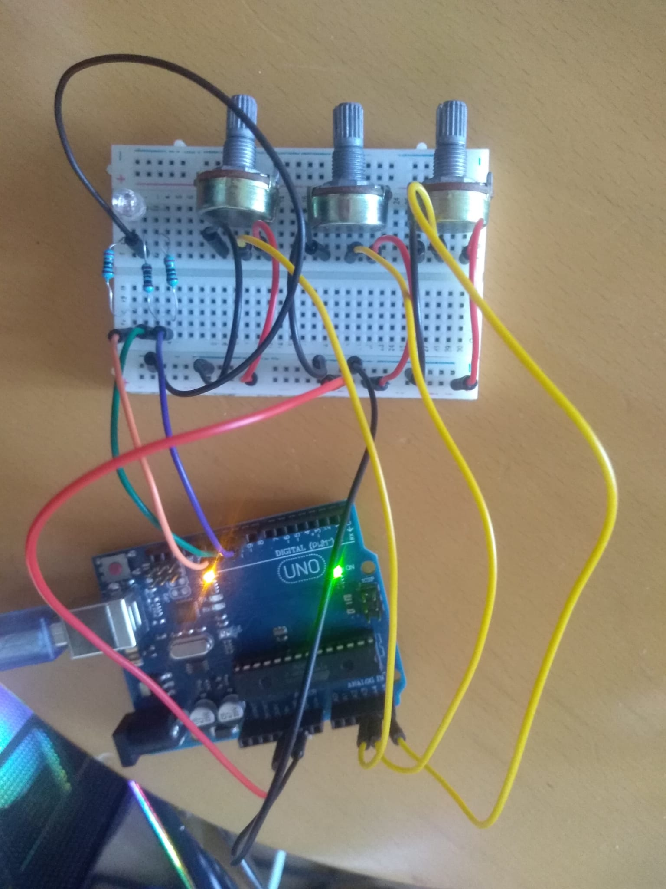

# IntroductionToRobotics (2022 - 2023?)
Hello! I am Andrei and here i will upload, HOPEFULLY, all of my homeworks this semester for my subject: Introduction to Robotics, laboratory.

Friendly reminder: coding style is REALLY important!

Thanks for reading this, i appreciate.

# Homework 1
Task requirements:

Using minimum 1 RGB led and 3 potentiometers, resistors and wires accordingly, control each one of the led's 3 colours with one potentiometer.
Values coming from potentiometers must be mapped to values that will be given as input for the led.

    
  

Video link: https://drive.google.com/file/d/1j_6o8F_s4XQYbD_QbgjprxdQxxQyMSDT/view?usp=sharing
