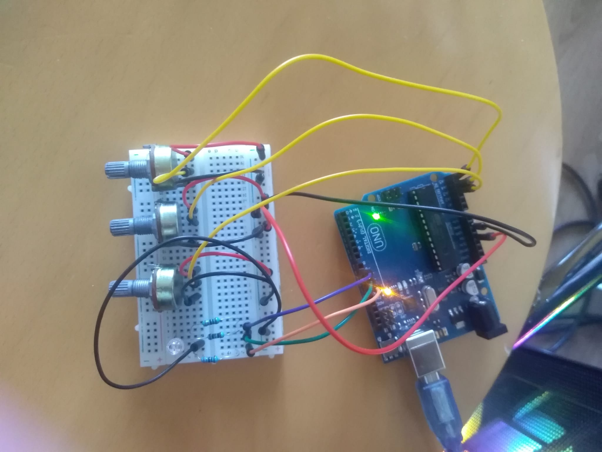
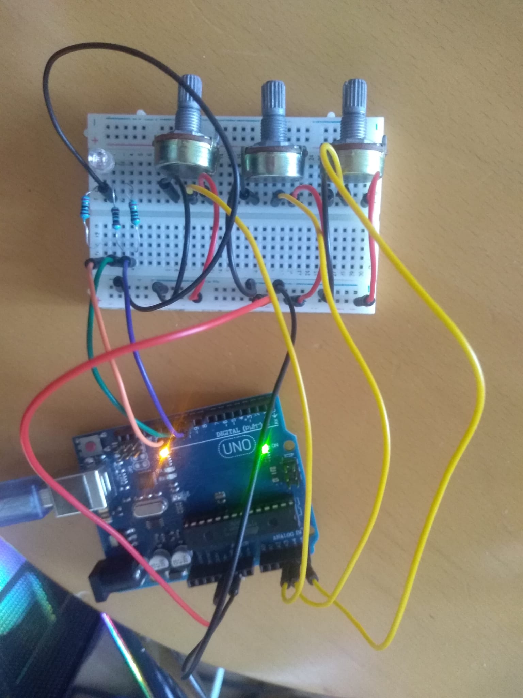
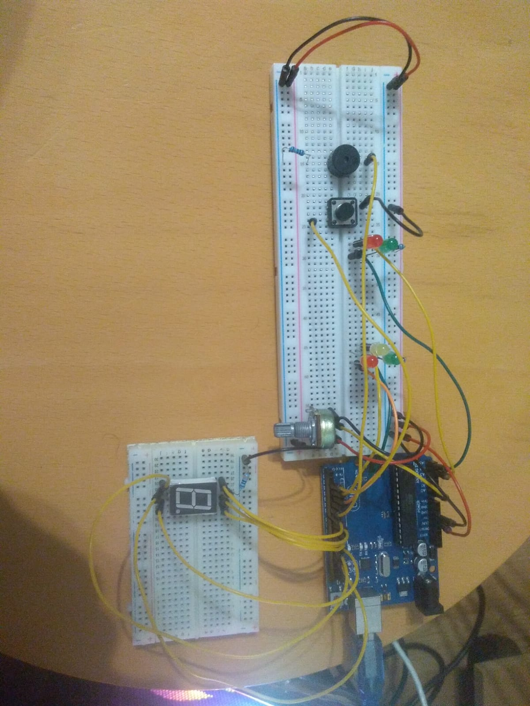
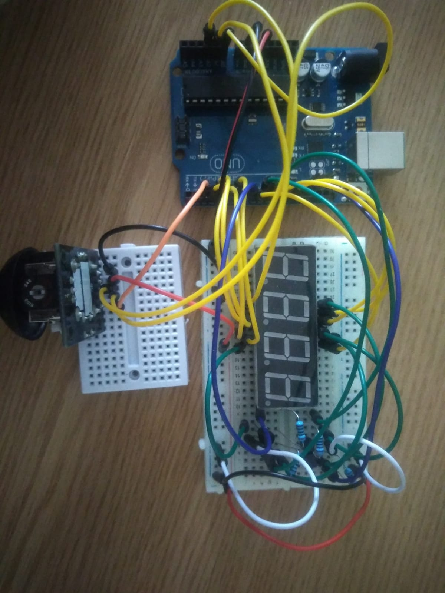
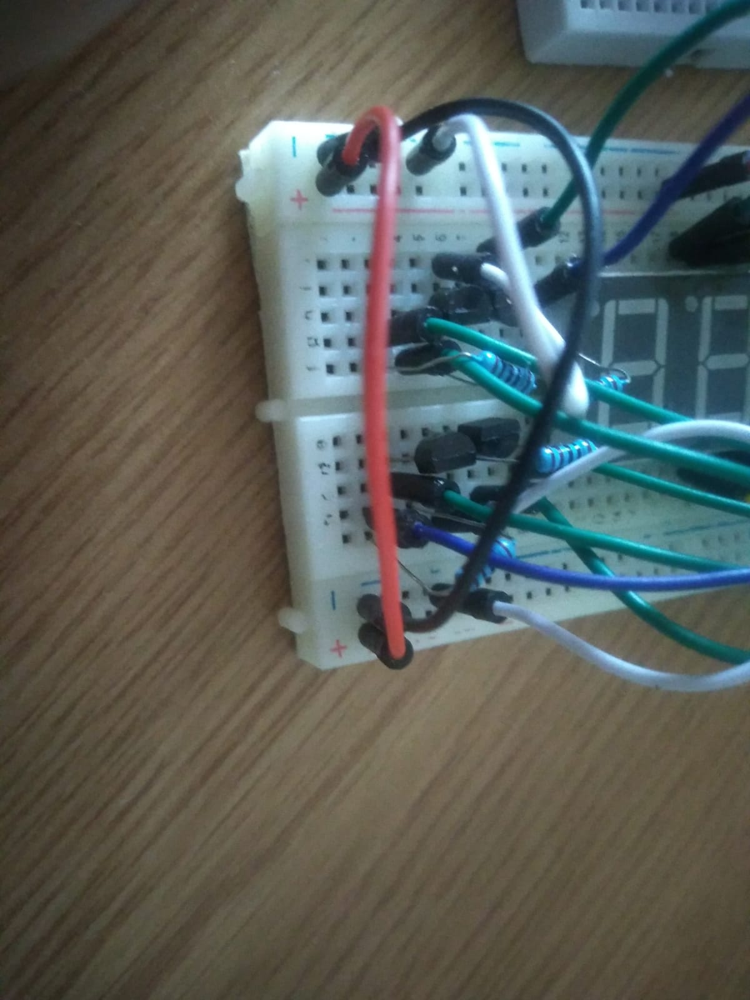
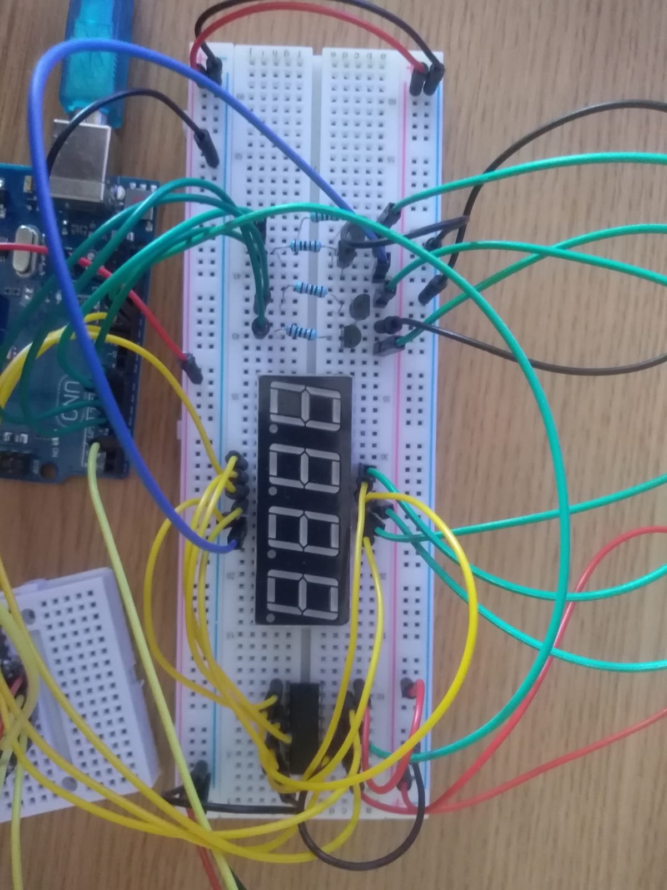
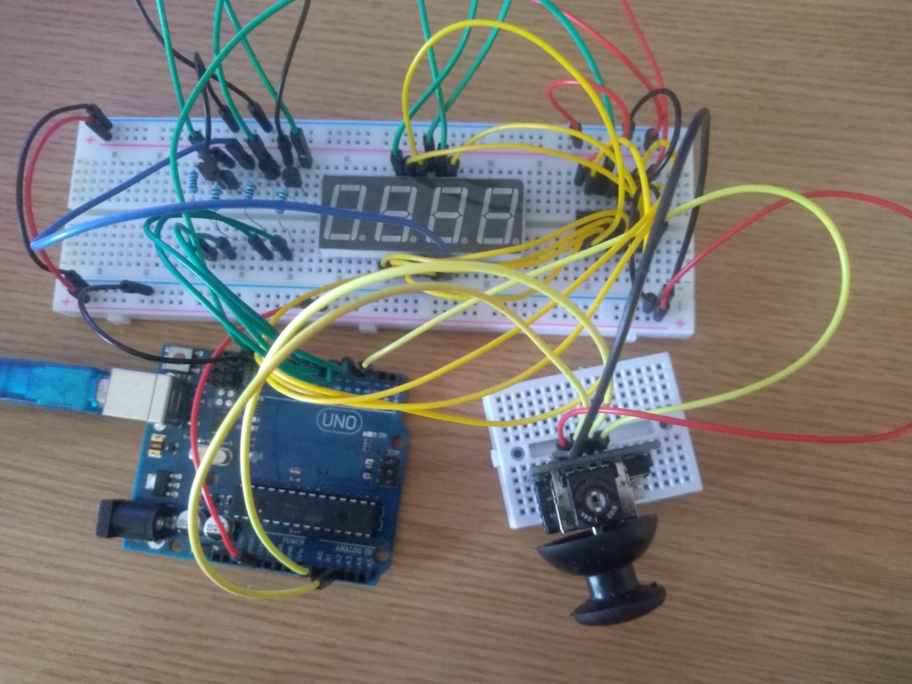
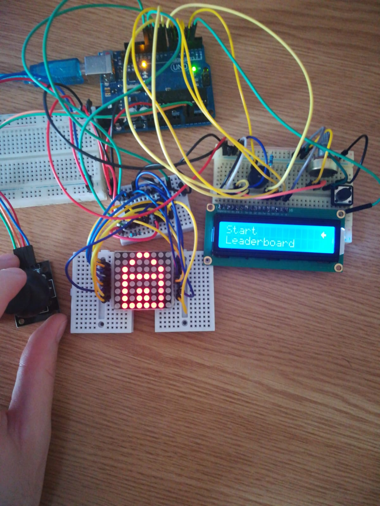

# IntroductionToRobotics (2022 - 2023?)
Hello! I am Andrei and here i will upload, HOPEFULLY, all of my homeworks this semester for my subject: Introduction to Robotics, laboratory.

Friendly reminder: coding style is REALLY important!

Thanks for reading this, i appreciate.

# Homework 1
Task requirements:

Using minimum 1 RGB led and 3 potentiometers, resistors and wires accordingly, control each one of the led's 3 colours with one potentiometer.
Values coming from potentiometers must be mapped to values that will be given as input for the led.

    
  

Video link: https://drive.google.com/file/d/1j_6o8F_s4XQYbD_QbgjprxdQxxQyMSDT/view?usp=sharing

# Homework 2
Task requirements:

Using 5LEDs, 1 button, 1 buzzer, resistors and wires accordingly, create the traffic lights for a crosswalk.

Implementation:

I've used 2 green LEDs and 2 red LEDs one of each for cars, the other for pedestrians and one yellow LED for cars. I've also added a
potentiometer which represents the traffic state at that point: taking values from 0 to 1023 from the potentiometer and mapping them 
to a value in the iterval 1 to 5 seconds. Depending on how busy the traffic is the pedestrians have to wait more/less time. When button is not pressed cars
have green light, pedestrians have red light and the buzzer makes a shot shound every 2 seconds so that blind people can know that there is a crosswalk around
but is red light. When pressing the button I check traffic state and set the waitting time value. After the waitting time is over the buzzer starts ringing
constantly, cars will have yellow light for 1 second and then red, at the same time pedestrians' traffic light will turn green. To make pedestrians' life easier
I have added a 7 segment digit display that shows how many seconds are left for them to pass. When timer goes under 4 seconds the light starts blinking and
the buzzer starts beeping at a constant interval synchronized with the LED's blinking. When timer shows 0, pedestrians' traffig light turns red and 1 seconds after
cars' traffic light turns green again. Aditionally, after pedestrians' traffic light turns red there is a 3 seconds delay untill next cycle regarding the traffic, pressing the button when in cooldown will register you action but it will get triggered only after the button and traffic delay.
Stay safe and be carefull when you cross the stree regardless of the traffic light color!!!

    

Video link: https://drive.google.com/file/d/1m-6RgrHTZjZSGyU8Q3obbON2Pv1ohxRz/view?usp=share_link

# Homework 3
Task requirements:

Using 7 segment display, 1 joystic, resistors and wires accordingly, create a minigame where the player can draw whatever he wants on the display.
There will be 2 states:
In the first one the player can move the segment with the joystick. The selected segment will blink regarless of its state. Then in order to change and go to next stage he can press the button shortly. If he presses the button for more than 2 seconds the display resets. 
In the second state the player can change the state of the selected segment by moving the joystick, and then return to first state with a button press.

Implementation:

I've used a 4 display 7 segment display. I've kept the same requirements but for my implementation the player can walk through all the displays.

    

    

Video link: https://drive.google.com/file/d/1g-SBHOIyHQnBhjMFPgNP_gBdymhwdEgE/view?usp=share_link

# Homework 4
Task requirements:

Using 7 segment display, 1 joystic, resistors and wires accordingly, create a minigame where the player can set each display to a digit in hexa.
 
Implementation:

There are 2 states: in the first one the player can move through the displays by using the x axis from the joystick. Dp led from the selected display will blink to
show the player which display he is currently on. After pressing the button the second state kicks in, now the player can change the number displayed by using y axis
and the dp stays on to signal that the game is in state 2. After pressing the button again the game turn back into first state and so on.
Additonally, by long pressing the button in state 1, the display resets to the initial state.

    

    

Video link: https://drive.google.com/file/d/1UwrktR-YvB-5GNeu_UTJiPILpDhP8uEh/view?usp=share_link

# Homework 5
Task requirements:

Using an lcd display, 8x8 led matrix, a joystick and a button create a mini game and a menu for it.

Implementation:

I created a dodge mini game: there are 4 enemies, one on each side of the matrix, moving on its own side one corner to the other. From time to time a random enemy will shoot a bullet. The player can move using the joystick and has to survive, dodging the bullet and the enemies, for as long as possible. 
*Interaction between player and enemies/bullets is not implemented yet

For the menu I created few stages:
1) When game starts a greeting message will appear for few secons
2) After that, the main menu will appear, with multiple options:

  -start game
  
  -leaderboard
  
  -setting
  
  -how to play
  
  -credits
  
  a) start game will display a screen where player can choose a name and then press the button to start the game
  
  b) ledearboard will display top 5 scores
  
  c) settings will display few options: matrix brightness, lcd brightness and contrast and starting difficulty
  
  d) how to play will list game commands
  
  e) credits will display the author and the github where people can find the project
  
3) During the game the lcd displays player name. 
4) When player loses the game pauses and the lcd displays player's name and score.

    

Video link: https://drive.google.com/file/d/1Qg6Ng-k4l-_6hpUIt1SjbWH_cGsrGW0l/view?usp=share_link
